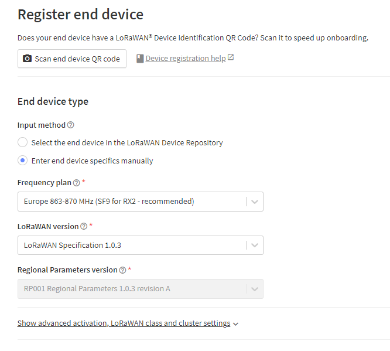

# LoraParticulateMatterSensor
- [ELV LoRaWAN® Feinstaubsensor, ELV-LW-SPM](https://de.elv.com/p/elv-lorawan-feinstaubsensor-elv-lw-spm-P160408)
- [ELV LoRaWAN® Feinstaubsensor - ELV stellt vor! (Youtube)](https://www.youtube.com/watch?v=3JDZIYmv3bQ)

A fine dust sensor that transmits sensor values via the LoRaWAN network. The power supply can be from 5-40V DC. A Sensirion SPS30 sensor is installed inside.

## Power Consumption
We have tested the power consumption of the ELV sensor. It requires approx. 60mA, which is unfortunately quite a lot if you want to operate it via a battery. A constant power supply is therefore required. Since the sensor could be used quite independently via LoRa, it would be really great if ELV could make improvements here. According to the documentation, the SPS30 would also support "low-power operation", in which it would only require 38 μA in idle mode. The sensor is currently running in continuous operation and you can hear the fan all the time.

The spike that is recognizable is the sending process via Lora, which is then configurable by the interval.

## The Things Network

To register the sensor in "The Things Network" you still need these settings. Unfortunately, there is currently (July 2024) no possibility to select the device directly via the search.

## Calculation of battery life

With a consumption of 60mA (Current consumption of the fine dust sensor from ELV)

| Size    | Estimated Battery Life  |
|---------|-------------------------|
| 2000mAh | 33 hours                |
| 8000mAh | 5 days 13 hours         |

With a consumption of 5mA (minus the 55mA according to the data sheet of sps30 the average consumption in operation)

| Size    | Estimated Battery Life  |
|---------|-------------------------|
| 2000mAh | 16 days 16 hours        |
| 8000mAh | 66 days 16 hours        |
